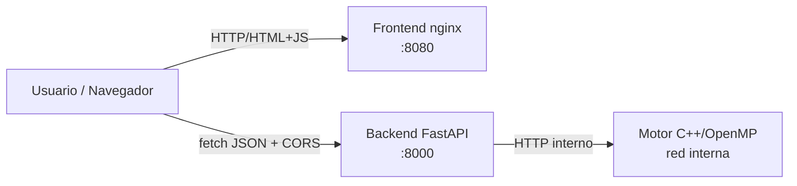

# 01 — Arquitectura

## Visión general

El sistema está compuesto por tres contenedores independientes que se comunican por la red del clúster:

1. **Motor** (C++/OpenMP) — proceso de larga vida que recibe un estado de tablero y devuelve la jugada óptima. Es el componente paralelizado y sujeto principal de la instrumentación.
2. **Backend** (Python + FastAPI) — wrapper HTTP que expone la API pública al frontend, valida la entrada y delega el cálculo al motor.
3. **Frontend** (HTML/JS + nginx) — servidor web que entrega los archivos estáticos del cliente. El navegador consume la API del backend.

No se incluye base de datos en esta entrega (componente opcional).

## Diagrama de orquestación



## Contrato de la API REST

Toda la comunicación es **JSON** con `Content-Type: application/json; charset=utf-8`. Los schemas se validan con `pydantic`; entrada malformada devuelve **HTTP 422**.

### Endpoints

| Método | Ruta | Descripción |
|---|---|---|
| `POST` | `/move` | Calcula la jugada óptima para un estado dado. |
| `GET` | `/healthz` | Liveness probe. |
| `GET` | `/readyz` | Readiness probe (200 solo si el motor está accesible). |
| `GET` | `/metrics` | Métricas agregadas por algoritmo. |

### Schema de `POST /move`

Request:

```json
{
  "board": [4,4,4,4,4,4,0, 4,4,4,4,4,4,0],
  "side": 0,
  "algo": "alphabeta",
  "depth": 12,
  "threads": 4
}
```

- `board`: arreglo de **14 enteros** (12 hoyos + 2 kalahas) en orden canónico.
- `side`: `0` o `1` — jugador al que le toca mover.
- `algo`: `"alphabeta"` | `"mcts"`.
- `depth`: obligatorio si `algo == "alphabeta"`.
- `simulations`: obligatorio si `algo == "mcts"`.
- `threads`: número de hilos OpenMP a usar.

Response (Alfa-Beta):

```json
{
  "move": 3,
  "evaluation": 7,
  "elapsed_ms": 124,
  "stats": { "algo": "alphabeta", "nodes": 1845210, "prunes": 312088 },
  "threads_used": 4
}
```

Response (MCTS):

```json
{
  "move": 3,
  "evaluation": 0.62,
  "elapsed_ms": 118,
  "stats": { "algo": "mcts", "rollouts": 100000, "tree_depth_avg": 14.3, "win_rate": 0.62 },
  "threads_used": 4
}
```

Códigos HTTP: `200` éxito, `400` entrada inválida, `422` schema inválido, `500` error interno, `503` motor no disponible.

## Política de CORS

El backend declara explícitamente los orígenes permitidos — **no se usa el comodín `*`**.

Orígenes permitidos:
- `http://localhost:8080` (frontend en local).
- `https://mancala.midominio.cloud` (frontend en la nube, ajustar al dominio real).

Métodos permitidos: `GET`, `POST`, `OPTIONS`.
Cabeceras permitidas: `Content-Type`.

El middleware maneja correctamente las peticiones preflight `OPTIONS` que el navegador envía antes de cualquier `POST` con `Content-Type: application/json`.

> **Pendiente de completar**: ampliar descripción de cada contenedor, detalle del orden canónico del tablero, y diagrama de secuencia de una petición completa.
