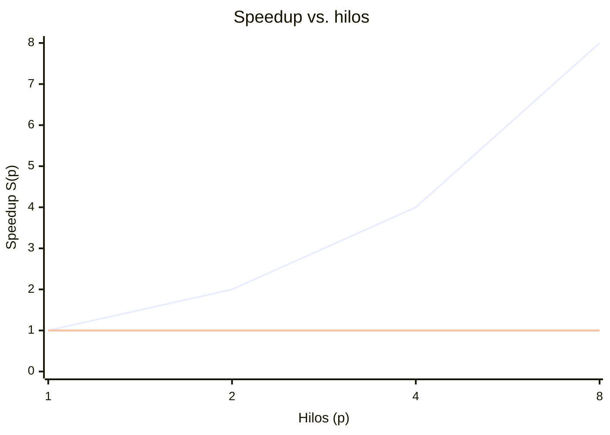

# 03 — Paralelización con OpenMP

## Estrategia para Alfa-Beta: paralelismo a la raíz (root parallelism)

Se implementó **root parallelism** (`motor/src/alphabeta.cpp`). Se eligió porque
es la estrategia base exigida, es la más simple de razonar y permite aislar con
claridad el fenómeno central del proyecto: la pérdida de podas al paralelizar.

Cómo funciona: los movimientos legales del nodo raíz se reparten entre hilos con
`#pragma omp parallel for schedule(dynamic, 1)`, y cada hilo ejecuta una búsqueda
Alfa-Beta **secuencial** sobre su sub-árbol con contadores privados de nodos y
podas. Al terminar, se reducen los resultados y se elige el movimiento de mayor
valor.

```text
#pragma omp parallel for num_threads(T) schedule(dynamic, 1)
para i en 0..num_movimientos_raiz:
    hijo = aplicar(raiz, movimiento[i])
    valor[i] = alphabeta(hijo, depth-1, -INF, +INF, root_side)   # cotas locales
reducir: mejor = argmax(valor)
```

Se usa `schedule(dynamic, 1)` porque los sub-árboles tienen costos muy desiguales
(unos podan pronto, otros no), y el reparto dinámico evita que un hilo quede
ocioso mientras otro carga con la rama más pesada.

### Costo de sincronización de las cotas α y β

Este es el punto clave. En el Alfa-Beta **secuencial**, las cotas α y β que se
afinan al explorar el primer hijo se **heredan** a los hermanos siguientes, y esa
información es la que produce la mayoría de las podas. Al repartir los hijos de la
raíz entre hilos, cada uno arranca con cotas neutras `(-INF, +INF)` y **no
comparte** los límites que los demás van descubriendo. Consecuencia directa:

- Se **pierden las podas entre hijos de la raíz**: ramas que el algoritmo
  secuencial habría cortado, en paralelo se exploran completas.
- El número total de **nodos explorados crece** con el número de hilos, aunque el
  movimiento elegido y el valor sean los mismos.
- El speedup real queda por **debajo del ideal**: parte del trabajo de los hilos
  es trabajo que la versión secuencial nunca habría hecho.

Compartir α/β globalmente entre hilos exigiría sincronización (una variable
atómica o un lock por actualización de cota) que serializaría justo el camino
crítico y, en la práctica, suele costar más de lo que ahorra. Estrategias como
**YBWC** o **PVS** mitigan esto explorando primero un hijo en secuencial para
obtener una buena cota antes de abrir el paralelismo; quedan como trabajo futuro
(ver [08-conclusiones.md](08-conclusiones.md)). Esta pérdida se cuantifica abajo
comparando la columna de nodos a 1 hilo contra la de 8 hilos.

## Estrategia para MCTS: paralelización a la raíz (root parallelization)

Para MCTS (`motor/src/mcts.cpp`) se usó **root parallelization**: cada hilo
construye su **propio árbol** sobre la misma posición raíz con una semilla
distinta, y al final se **combinan** las estadísticas (visitas y victorias) de los
hijos de la raíz. No hay sincronización durante la búsqueda, solo una reducción al
final, por lo que escala casi linealmente. Su costo es la **exploración
redundante** (cada árbol vuelve a descubrir las mismas jugadas buenas) frente a
una *tree parallelization* que compartiría un único árbol a cambio de sincronizar
los contadores con `atomic`/locks y *virtual loss*.

## Instrumentación

El motor corre en **modo benchmark** sin pasar por el backend, leyendo las
posiciones de `motor/tests/suite.txt`.

### Métricas comunes

- Tiempo de pared $T(p)$ medido con `omp_get_wtime`.
- **Speedup**: $S(p) = T(1) / T(p)$.
- **Eficiencia**: $E(p) = S(p) / p$.

### Específicas de Alfa-Beta

Por cada par (profundidad, hilos): número de **nodos explorados** y número de
**podas** efectuadas. La razón nodos(8)/nodos(1) mide la pérdida de podas.

### Específicas de MCTS

Por cada par (simulaciones, hilos): **rollouts** totales y **profundidad media**
del árbol construido.

## Barrido experimental

Mediciones para $p \in \{1, 2, 4, 8\}$ hilos, en dos profundidades de Alfa-Beta
(`depth=8` y `depth=12`) y dos presupuestos de MCTS (`simulations=10000` y
`100000`). Las tablas siguientes se generan automáticamente con:

```bash
cd motor && ./bench/run_benchmarks.sh
```

El script compila en Release, corre el barrido sobre la suite y emite las tablas
en Markdown listas para pegar aquí. **Deben llenarse con la salida real medida en
la máquina de pruebas** (Linux con OpenMP); no se incluyen números inventados.

Alfa-Beta, `depth=8`:

| p | T(p) [s] | S(p) | E(p) |
|---|---|---|---|
| 1 | _(del script)_ | 1.00 | 1.00 |
| 2 | _(del script)_ | _(del script)_ | _(del script)_ |
| 4 | _(del script)_ | _(del script)_ | _(del script)_ |
| 8 | _(del script)_ | _(del script)_ | _(del script)_ |

Alfa-Beta, `depth=12`:

| p | T(p) [s] | S(p) | E(p) |
|---|---|---|---|
| 1 | _(del script)_ | 1.00 | 1.00 |
| 2 | _(del script)_ | _(del script)_ | _(del script)_ |
| 4 | _(del script)_ | _(del script)_ | _(del script)_ |
| 8 | _(del script)_ | _(del script)_ | _(del script)_ |

MCTS, `simulations=100000`:

| p | T(p) [s] | S(p) | E(p) |
|---|---|---|---|
| 1 | _(del script)_ | 1.00 | 1.00 |
| 2 | _(del script)_ | _(del script)_ | _(del script)_ |
| 4 | _(del script)_ | _(del script)_ | _(del script)_ |
| 8 | _(del script)_ | _(del script)_ | _(del script)_ |

### Pérdida de podas (Alfa-Beta, `depth=12`)

| p | Nodos explorados | Podas | Nodos(p)/Nodos(1) |
|---|---|---|---|
| 1 | _(del script)_ | _(del script)_ | 1.00 |
| 8 | _(del script)_ | _(del script)_ | _(del script)_ |

Un cociente Nodos(8)/Nodos(1) mayor que 1 confirma cuántos nodos extra explora la
versión paralela por no compartir las cotas α/β.

## Gráfica de speedup

Plantilla de gráfica para GitHub (Mermaid `xychart-beta`). **Reemplazar los
valores de ejemplo por los del barrido real** antes de la entrega:



La línea `ideal` es la referencia $S(p) = p$. La distancia entre la curva real y
la ideal es, en Alfa-Beta, principalmente la pérdida de podas discutida arriba.

## Herramientas de profiling

Se documenta el uso de al menos dos herramientas, con capturas como evidencia.

```bash
# Alfa-Beta secuencial (línea base)
OMP_NUM_THREADS=1 ./build/mancala_bench --algo alphabeta --depth 12 \
    --positions tests/suite.txt

# Contadores de hardware con perf
OMP_NUM_THREADS=8 perf stat -e cycles,instructions,cache-misses \
    ./build/mancala_bench --algo alphabeta --depth 12 --threads 8 \
    --positions tests/suite.txt

# Tiempo y memoria máxima residente
OMP_NUM_THREADS=8 /usr/bin/time -v ./build/mancala_bench --algo alphabeta \
    --depth 12 --threads 8 --positions tests/suite.txt

# Ocupación de núcleos en vivo (en otra terminal mientras corre el bench)
htop
```

> Adjuntar aquí las capturas de `perf stat`, `htop` (núcleos ocupados durante la
> búsqueda paralela) y `/usr/bin/time -v` (RSS máximo), referenciadas con rutas
> relativas desde este Markdown.
