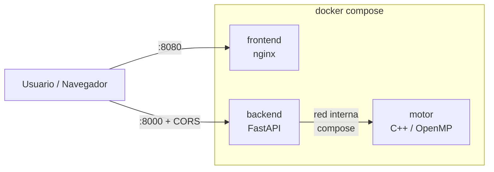

# 04 — Despliegue Local

## Dockerfiles de cada componente

- [`motor/Dockerfile`](../motor/Dockerfile) — imagen multi-stage con `g++` + `cmake` + OpenMP en la etapa de build, imagen mínima en runtime.
- [`backend/Dockerfile`](../backend/Dockerfile) — base `python:3.12-slim`, instala `fastapi`/`uvicorn`/`pydantic`, expone `8000`.
- [`frontend/Dockerfile`](../frontend/Dockerfile) — `nginx:alpine` sirviendo los estáticos del cliente en `:80`.

## Docker Compose

El archivo [`deploy/local/docker-compose.yml`](../deploy/local/docker-compose.yml) levanta los 3 contenedores con un solo comando:

```powershell
cd deploy\local
docker compose up --build
```

Resultado:
- Frontend en `http://localhost:8080`
- Backend en `http://localhost:8000`
- Motor en la red interna del compose (no expone puertos al host).

## Diagrama de flujo de contenedores (local)



## Kubernetes local (kind / minikube / k3d)

Manifiestos ya escritos en [`deploy/local/k8s/`](../deploy/local/k8s/):

| Archivo | Contenido |
|---|---|
| `00-namespace.yaml` | Namespace `mancala`. |
| `10-configmap.yaml` | Variables del motor (`OMP_NUM_THREADS`, `MOTOR_PORT`, profundidad, CORS). |
| `20-motor.yaml` | `Deployment` + `Service` ClusterIP del motor (red interna). |
| `30-backend.yaml` | `Deployment` con **3 réplicas** + `Service` NodePort (30080). |
| `40-frontend.yaml` | `Deployment` (1 réplica) + `Service` NodePort (30088). |

Cumplimiento de la rúbrica:

- `Deployment` del backend con **≥ 3 réplicas**.
- `Service` ClusterIP interno (`motor-svc`) + NodePort para exposición
  (`backend-svc` en 30080, `frontend-svc` en 30088).
- `ConfigMap` con las variables del motor.
- **Probes** `liveness` (`/healthz`) y `readiness` (`/readyz`) en backend y motor.
- `requests` y `limits` de CPU y memoria declarados en cada contenedor.

### Comandos para reproducir el despliegue

```bash
# Crear clúster local (ejemplo con kind)
kind create cluster --name mancala

# Construir y cargar imágenes en el clúster
docker build -t mancala-motor:dev ../../motor
docker build -t mancala-backend:dev ../../backend
docker build -t mancala-frontend:dev ../../frontend
kind load docker-image mancala-motor:dev mancala-backend:dev mancala-frontend:dev --name mancala

# Aplicar manifiestos
kubectl apply -f k8s/

# Verificar
kubectl get pods,svc -n mancala
```

Acceso tras aplicar los manifiestos:

- Frontend: `http://localhost:30088`
- Backend: `http://localhost:30080` (`/healthz`, `/readyz`, `/metrics`, `POST /move`)

> Recuerda ajustar `frontend/public/config.js` para que el navegador apunte al
> backend en `http://<IP-del-nodo>:30080` cuando uses NodePort (ver el README de
> la raíz).
>
> Adjuntar aquí la captura de `kubectl get pods,svc -n mancala` con todo en
> `Running`/`Ready` como evidencia del despliegue local.
