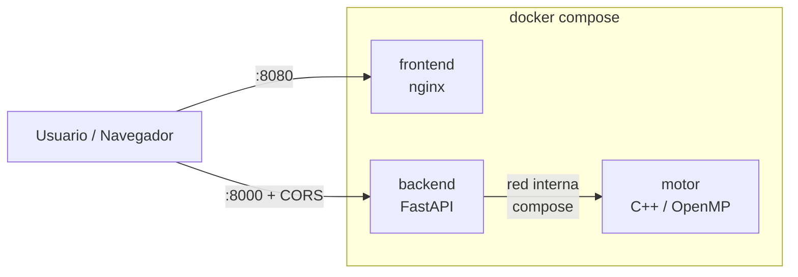

# 04 — Despliegue Local

## Dockerfiles de cada componente

- [`motor/Dockerfile`](../motor/Dockerfile) — imagen multi-stage con `g++` + `cmake` + OpenMP en la etapa de build, imagen mínima en runtime.
- [`backend/Dockerfile`](../backend/Dockerfile) — base `python:3.12-slim`, instala `fastapi`/`uvicorn`/`pydantic`, expone `8000`.
- [`frontend/Dockerfile`](../frontend/Dockerfile) — `nginx:alpine` sirviendo los estáticos del cliente en `:80`.

## Docker Compose

El archivo [`deploy/local/docker-compose.yml`](../deploy/local/docker-compose.yml) levanta los 3 contenedores con un solo comando:

```powershell
cd deploy\local
docker compose up --build
```

Resultado:
- Frontend en `http://localhost:8080`
- Backend en `http://localhost:8000`
- Motor en la red interna del compose (no expone puertos al host).

## Diagrama de flujo de contenedores (local)



## Kubernetes local (kind / minikube / k3d)

Manifiestos en [`deploy/local/k8s/`](../deploy/local/k8s/). Mínimo exigido:

- `Deployment` del backend con **≥ 3 réplicas**.
- `Service` (ClusterIP interno + NodePort/LoadBalancer para exposición).
- `Deployment` y `Service` para el frontend.
- `ConfigMap` con variables del motor (`OMP_NUM_THREADS`, profundidad por defecto).
- **Probes** `liveness` y `readiness` apuntando a `/healthz` y `/readyz`.

### Comandos para reproducir el despliegue

```bash
# Crear clúster local (ejemplo con kind)
kind create cluster --name mancala

# Construir y cargar imágenes en el clúster
docker build -t mancala-motor:dev ../../motor
docker build -t mancala-backend:dev ../../backend
docker build -t mancala-frontend:dev ../../frontend
kind load docker-image mancala-motor:dev mancala-backend:dev mancala-frontend:dev --name mancala

# Aplicar manifiestos
kubectl apply -f k8s/

# Verificar
kubectl get pods,svc
```

> **Pendiente**: escribir los manifiestos YAML reales en `deploy/local/k8s/`.
