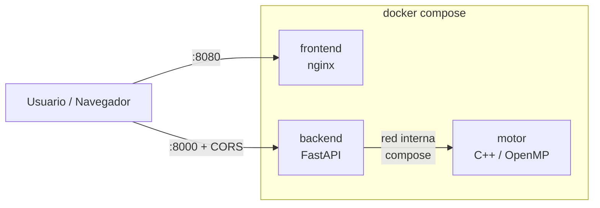
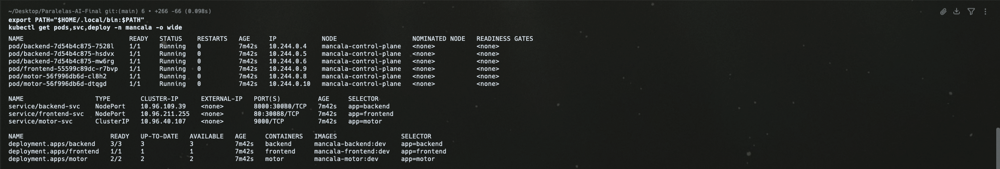

# 04 — Despliegue Local

## Dockerfiles de cada componente

- [`motor/Dockerfile`](../motor/Dockerfile) — imagen multi-stage con `g++` + `cmake` + OpenMP en la etapa de build, imagen mínima en runtime.
- [`backend/Dockerfile`](../backend/Dockerfile) — base `python:3.12-slim`, instala `fastapi`/`uvicorn`/`pydantic`, expone `8000`.
- [`frontend/Dockerfile`](../frontend/Dockerfile) — `nginx:alpine` sirviendo los estáticos del cliente en `:80`.

## Docker Compose

El archivo [`deploy/local/docker-compose.yml`](../deploy/local/docker-compose.yml) levanta los 3 contenedores con un solo comando:

```powershell
cd deploy\local
docker compose up --build
```

Resultado:
- Frontend en `http://localhost:8080`
- Backend en `http://localhost:8000`
- Motor en la red interna del compose (no expone puertos al host).

## Diagrama de flujo de contenedores (local)



## Kubernetes local (kind / minikube / k3d)

Manifiestos ya escritos en [`deploy/local/k8s/`](../deploy/local/k8s/):

| Archivo | Contenido |
|---|---|
| `00-namespace.yaml` | Namespace `mancala`. |
| `10-configmap.yaml` | Variables del motor (`OMP_NUM_THREADS`, `MOTOR_PORT`, profundidad, CORS). |
| `20-motor.yaml` | `Deployment` + `Service` ClusterIP del motor (red interna). |
| `30-backend.yaml` | `Deployment` con **3 réplicas** + `Service` NodePort (30080). |
| `40-frontend.yaml` | `Deployment` (1 réplica) + `Service` NodePort (30088). |

Cumplimiento de la rúbrica:

- `Deployment` del backend con **≥ 3 réplicas**.
- `Service` ClusterIP interno (`motor-svc`) + NodePort para exposición
  (`backend-svc` en 30080, `frontend-svc` en 30088).
- `ConfigMap` con las variables del motor.
- **Probes** `liveness` (`/healthz`) y `readiness` (`/readyz`) en backend y motor.
- `requests` y `limits` de CPU y memoria declarados en cada contenedor.

### Comandos para reproducir el despliegue

```bash
# Crear clúster local (ejemplo con kind)
kind create cluster --name mancala

# Construir y cargar imágenes en el clúster
docker build -t mancala-motor:dev ../../motor
docker build -t mancala-backend:dev ../../backend
docker build -t mancala-frontend:dev ../../frontend
kind load docker-image mancala-motor:dev mancala-backend:dev mancala-frontend:dev --name mancala

# Aplicar manifiestos
kubectl apply -f k8s/

# Verificar
kubectl get pods,svc -n mancala
```

Acceso tras aplicar los manifiestos:

- Frontend: `http://localhost:30088`
- Backend: `http://localhost:30080` (`/healthz`, `/readyz`, `/metrics`, `POST /move`)

> Recuerda ajustar `frontend/public/config.js` para que el navegador apunte al
> backend en `http://<IP-del-nodo>:30080` cuando uses NodePort (ver el README de
> la raíz).

### Evidencia del despliegue local

Salida real tras aplicar los manifiestos en un clúster `kind` (`kindest/node:v1.31.0`).
Backend con 3 réplicas, motor con 2 y frontend con 1, todos `Running`/`Ready`:

```text
$ kubectl get deploy -n mancala
NAME       READY   UP-TO-DATE   AVAILABLE   AGE
backend    3/3     3            3           18s
frontend   1/1     1            1           18s
motor      2/2     2            2           18s

$ kubectl get pods,svc -n mancala -o wide
NAME                            READY   STATUS    RESTARTS   AGE   IP            NODE
pod/backend-7d54b4c875-7528l    1/1     Running   0          18s   10.244.0.4    mancala-control-plane
pod/backend-7d54b4c875-hsdvx    1/1     Running   0          18s   10.244.0.5    mancala-control-plane
pod/backend-7d54b4c875-mw6rg    1/1     Running   0          18s   10.244.0.6    mancala-control-plane
pod/frontend-55599c89dc-r7bvp   1/1     Running   0          18s   10.244.0.9    mancala-control-plane
pod/motor-56f996db6d-cl8h2      1/1     Running   0          18s   10.244.0.8    mancala-control-plane
pod/motor-56f996db6d-dtqgd      1/1     Running   0          18s   10.244.0.10   mancala-control-plane

NAME                   TYPE        CLUSTER-IP      EXTERNAL-IP   PORT(S)          AGE   SELECTOR
service/backend-svc    NodePort    10.96.109.39    <none>        8000:30080/TCP   18s   app=backend
service/frontend-svc   NodePort    10.96.211.255   <none>        80:30088/TCP     18s   app=frontend
service/motor-svc      ClusterIP   10.96.40.107    <none>        9000/TCP         18s   app=motor
```

Captura de la misma salida en el clúster `kind`:



Verificación funcional end-to-end a través del `Service` del backend
(`kubectl -n mancala port-forward svc/backend-svc 18000:8000`). El backend
resuelve el motor por la red interna del clúster (`motor-svc:9000`) y la jugada
se calcula correctamente:

```text
$ curl http://localhost:18000/readyz
{"status":"ready","motor":"http://motor-svc:9000"}   # HTTP 200

$ curl -X POST http://localhost:18000/move -H 'Content-Type: application/json' \
    -d '{"board":[4,4,4,4,4,4,0,4,4,4,4,4,4,0],"side":0,"depth":8,"threads":2}'
{"move":2,"evaluation":4.0,"elapsed_ms":1,"stats":{"nodes":38852,"prunes":10796},"threads_used":2}
```
