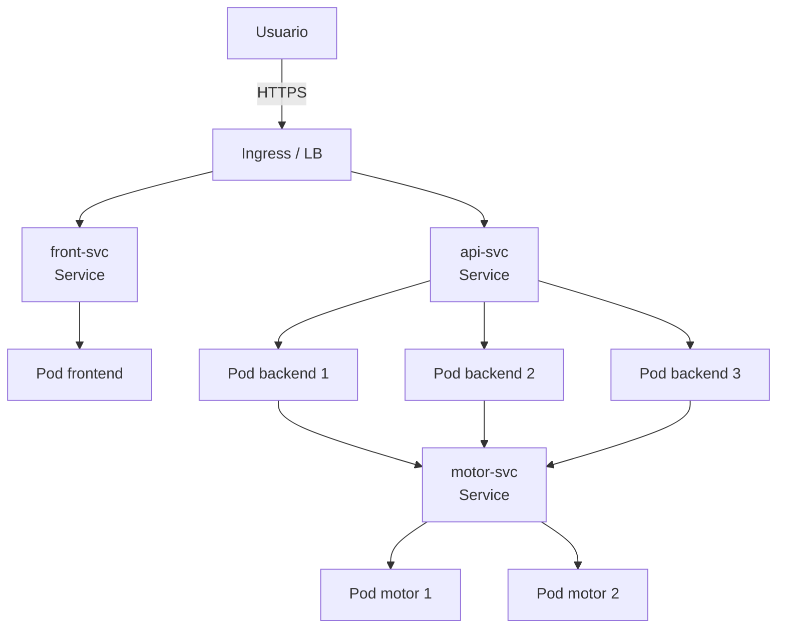

# 05 — Despliegue en la Nube

## Proveedor de Kubernetes gestionado

> **Pendiente de decidir**: AWS EKS / Azure AKS / GCP GKE.

La elección debe justificarse explícitamente en este archivo cuando se tome.

## Reglas innegociables

1. **Toda** la configuración del clúster y la aplicación está versionada en archivos YAML dentro de [`deploy/cloud/`](../deploy/cloud/). No se acepta configurar el despliegue solo desde la consola web del proveedor.
2. El balanceo de carga entre las réplicas del backend lo maneja el propio `Service` de Kubernetes (tipo `LoadBalancer` o vía `Ingress`).

## Componentes en la nube

- **Backend replicado**: ≥ 3 réplicas del wrapper Python + motor C++, servidas por el `Service` de Kubernetes.
- **Frontend**: una sola réplica, expuesta vía `Ingress` o `Service` tipo `LoadBalancer`.
- **Motor**: réplicas según la estrategia elegida.
- **Imágenes en un registro**: las imágenes del backend y del frontend están en un registro accesible por el clúster (Docker Hub / GHCR / ECR / ACR / GCR). El tag es **inmutable** (no se usa `latest`).
- **Recursos declarados**: cada contenedor declara `requests` y `limits` de CPU y memoria.

## Diagrama del despliegue



## Declaración de `requests` y `limits`

| Contenedor | requests CPU | requests RAM | limits CPU | limits RAM | Justificación |
|---|---|---|---|---|---|
| motor | — | — | — | — | pendiente |
| backend | — | — | — | — | pendiente |
| frontend | — | — | — | — | pendiente |

## Evidencia

Salidas de `kubectl` esperadas:

```bash
kubectl get pods,svc,deploy
kubectl describe deployment backend
kubectl top pods
```

> **Pendiente**: capturas reales de `kubectl get pods,svc,deploy` y del dashboard del proveedor.
