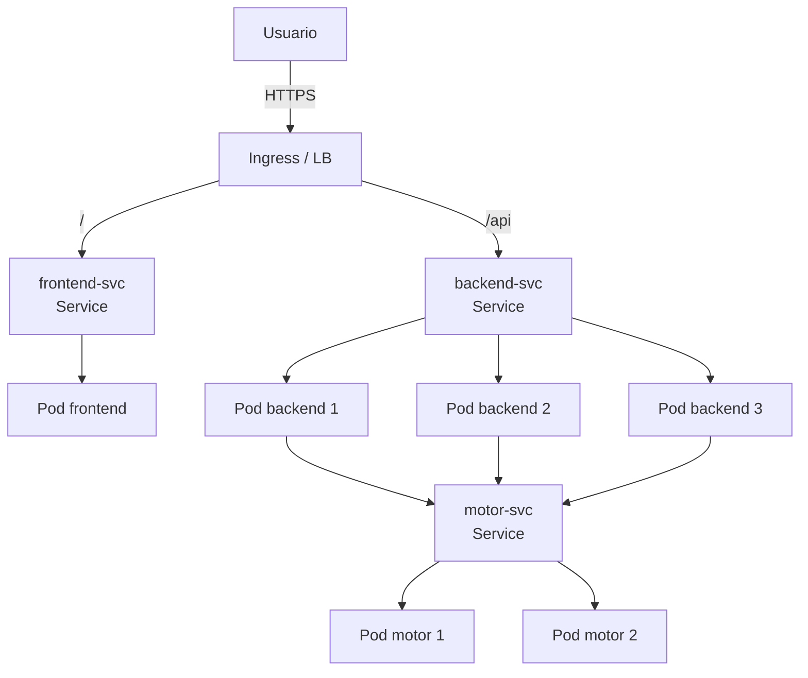

# 05 — Despliegue en la Nube

## Proveedor de Kubernetes gestionado

> **Decisión del grupo**: elegir entre AWS EKS / Azure AKS / GCP GKE y
> justificarlo aquí (p. ej. crédito de estudiante disponible, cercanía de
> región, familiaridad del equipo).

Los manifiestos de [`deploy/cloud/`](../deploy/cloud/) son **agnósticos del
proveedor**; lo único que cambia entre EKS/AKS/GKE son las anotaciones del
`Ingress` (clase de Ingress y, en su caso, el controlador del balanceador). Esos
puntos están marcados como comentarios `AJUSTAR` en `50-ingress.yaml`.

## Reglas innegociables

1. **Toda** la configuración del clúster y la aplicación está versionada en YAML
   dentro de [`deploy/cloud/`](../deploy/cloud/). Nada se configura solo desde la
   consola web del proveedor.
2. El balanceo entre las réplicas del backend lo hace el propio `Service` de
   Kubernetes, expuesto vía `Ingress`.

## Componentes en la nube

| Archivo | Contenido |
|---|---|
| `00-namespace.yaml` | Namespace `mancala`. |
| `10-configmap.yaml` | Variables del motor (incl. `OMP_NUM_THREADS=2` y orígenes CORS de producción). |
| `20-motor.yaml` | `Deployment` (2 réplicas) + `Service` ClusterIP del motor. |
| `30-backend.yaml` | `Deployment` con **3 réplicas** + `Service` ClusterIP. |
| `40-frontend.yaml` | `Deployment` (1 réplica) + `Service`. |
| `50-ingress.yaml` | `Ingress` que enruta `/` al frontend y `/api` al backend, con TLS. |
| `60-hpa.yaml` | `HorizontalPodAutoscaler` del backend (3→8 réplicas al 70% CPU). |

- **Imágenes en un registro**: el backend y el frontend (y el motor) se publican
  en GHCR desde CI con un **tag inmutable** (el SHA del commit, nunca `latest`).
  Hay que reemplazar `ghcr.io/<organizacion>/...:v0.2.0` en los manifiestos por el
  tag real publicado.
- **Recursos declarados**: cada contenedor declara `requests` y `limits` (abajo).

## Diagrama del despliegue



## Declaración de `requests` y `limits`

Valores declarados en los manifiestos de `deploy/cloud/`:

| Contenedor | requests CPU | requests RAM | limits CPU | limits RAM | Justificación |
|---|---|---|---|---|---|
| motor | 500m | 128Mi | 2000m | 512Mi | Es el componente intensivo en CPU; el límite alto (2 vCPU) le da margen para usar varios hilos OpenMP por pod. |
| backend | 100m | 128Mi | 500m | 256Mi | Solo valida y reenvía (I/O ligado); poca CPU basta. |
| frontend | 50m | 32Mi | 200m | 128Mi | nginx sirviendo estáticos; consumo mínimo. |

Declarar `requests`/`limits` es lo que hace honesto el análisis comparativo: fija
el presupuesto de recursos por pod para que comparar "más hilos por pod" contra
"más réplicas" sea justo.

## Reproducir y evidenciar

```bash
kubectl apply -f deploy/cloud/
kubectl get pods,svc,deploy -n mancala
kubectl describe deployment backend -n mancala
kubectl top pods -n mancala
```

> Adjuntar aquí las capturas reales de `kubectl get pods,svc,deploy -n mancala`
> (con las 3 réplicas del backend en `Running`) y del dashboard del proveedor.
> Estas evidencias se generan en el clúster del grupo; no se incluyen valores
> simulados.
