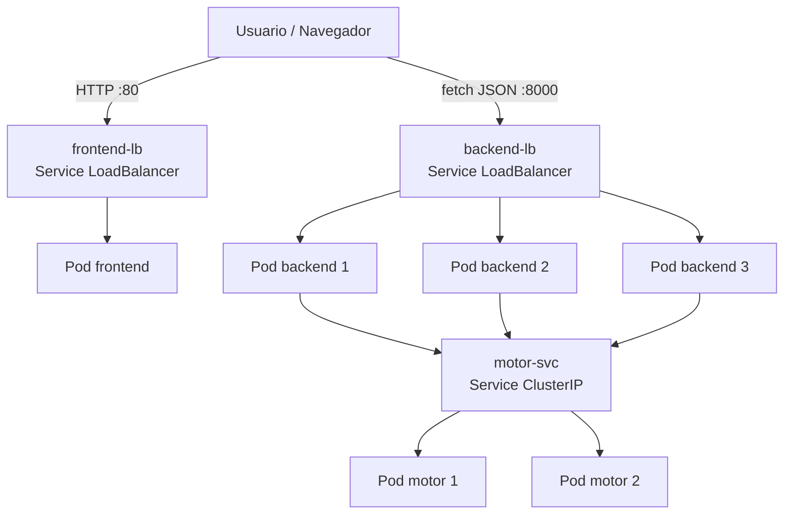

# 05 — Despliegue en la Nube

## Proveedor de Kubernetes gestionado

**Proveedor elegido: Google Cloud GKE** (Google Kubernetes Engine), modo
**Autopilot**. Se eligió por la disponibilidad de créditos de estudiante del
grupo, porque Autopilot gestiona los nodos automáticamente (menos superficie de
error) y porque su facturación por recursos solicitados encaja con la declaración
de `requests`/`limits` que exige el análisis comparativo. Las imágenes se publican
en **Artifact Registry** (registro de GCP).

Los manifiestos de [`deploy/cloud/`](../deploy/cloud/) son en su mayoría
agnósticos del proveedor; la exposición pública se hace con `Service` de tipo
`LoadBalancer` (`70-loadbalancers.yaml`), que en GKE crea un balanceador de red
con IP pública sin requerir un controlador de Ingress ni un dominio.

## Reglas innegociables

1. **Toda** la configuración del clúster y la aplicación está versionada en YAML
   dentro de [`deploy/cloud/`](../deploy/cloud/). Nada se configura solo desde la
   consola web del proveedor.
2. El balanceo entre las réplicas del backend lo hace el propio `Service` de
   Kubernetes, de tipo `LoadBalancer`.

## Componentes en la nube

| Archivo | Contenido |
|---|---|
| `00-namespace.yaml` | Namespace `mancala`. |
| `10-configmap.yaml` | Variables del motor (incl. `OMP_NUM_THREADS=2` y orígenes CORS de producción). |
| `20-motor.yaml` | `Deployment` (2 réplicas) + `Service` ClusterIP del motor. |
| `30-backend.yaml` | `Deployment` con **3 réplicas** + `Service` ClusterIP. |
| `40-frontend.yaml` | `Deployment` (1 réplica) + `Service`. |
| `50-ingress.yaml` | `Ingress` alternativo (`/`→frontend, `/api`→backend) para entornos con controlador Ingress; **no se usa en GKE**, donde se exponen los `LoadBalancer`. |
| `60-hpa.yaml` | `HorizontalPodAutoscaler` del backend (3→8 réplicas al 70% CPU). |
| `70-loadbalancers.yaml` | `Service` LoadBalancer del frontend (`:80`) y del backend (`:8000`) con IP pública. |

- **Imágenes en un registro**: las tres imágenes se publican en **Artifact
  Registry** (`us-central1-docker.pkg.dev/<PROJECT_ID>/mancala/...`) con un **tag
  inmutable** (`v0.2.0` o el SHA del commit, nunca `latest`). En los manifiestos
  hay que reemplazar el placeholder `ghcr.io/<organizacion>/...:v0.2.0` por la ruta
  real (lo hace el `sed` de la sección *Reproducir*).
- **Recursos declarados**: cada contenedor declara `requests` y `limits` (abajo).

## Diagrama del despliegue



## Declaración de `requests` y `limits`

Valores declarados en los manifiestos de `deploy/cloud/`:

| Contenedor | requests CPU | requests RAM | limits CPU | limits RAM | Justificación |
|---|---|---|---|---|---|
| motor | 500m | 128Mi | 2000m | 512Mi | Es el componente intensivo en CPU; el límite alto (2 vCPU) le da margen para usar varios hilos OpenMP por pod. |
| backend | 100m | 128Mi | 500m | 256Mi | Solo valida y reenvía (I/O ligado); poca CPU basta. |
| frontend | 50m | 32Mi | 200m | 128Mi | nginx sirviendo estáticos; consumo mínimo. |

Declarar `requests`/`limits` es lo que hace honesto el análisis comparativo: fija
el presupuesto de recursos por pod para que comparar "más hilos por pod" contra
"más réplicas" sea justo.

## Reproducir en GKE (desde cero)

```bash
# 0) Variables
export PROJECT_ID=$(gcloud config get-value project)
export REGION=us-central1
export REPO=$REGION-docker.pkg.dev/$PROJECT_ID/mancala
export TAG=v0.2.0

# 1) Habilitar APIs y crear el registro de imágenes
gcloud services enable container.googleapis.com artifactregistry.googleapis.com cloudbuild.googleapis.com
gcloud artifacts repositories create mancala --repository-format=docker --location=$REGION

# 2) Construir y publicar las 3 imágenes (Cloud Build → amd64, sirve desde Mac ARM)
gcloud builds submit motor    --tag $REPO/mancala-motor:$TAG
gcloud builds submit backend  --tag $REPO/mancala-backend:$TAG
gcloud builds submit frontend --tag $REPO/mancala-frontend:$TAG

# 3) Apuntar los manifiestos a Artifact Registry
sed -i '' "s|ghcr.io/<organizacion>/mancala-motor:v0.2.0|$REPO/mancala-motor:$TAG|"       deploy/cloud/20-motor.yaml
sed -i '' "s|ghcr.io/<organizacion>/mancala-backend:v0.2.0|$REPO/mancala-backend:$TAG|"   deploy/cloud/30-backend.yaml
sed -i '' "s|ghcr.io/<organizacion>/mancala-frontend:v0.2.0|$REPO/mancala-frontend:$TAG|" deploy/cloud/40-frontend.yaml

# 4) Crear el clúster (Autopilot) y obtener credenciales
gcloud container clusters create-auto mancala-cluster --location=$REGION
gcloud container clusters get-credentials mancala-cluster --location=$REGION

# 5) Desplegar (todo menos el Ingress, que en GKE se sustituye por LoadBalancers)
kubectl apply -f deploy/cloud/00-namespace.yaml -f deploy/cloud/10-configmap.yaml \
              -f deploy/cloud/20-motor.yaml -f deploy/cloud/30-backend.yaml \
              -f deploy/cloud/40-frontend.yaml -f deploy/cloud/60-hpa.yaml \
              -f deploy/cloud/70-loadbalancers.yaml

# 6) Evidencias
kubectl get pods,svc,deploy -n mancala       # backend 3/3, IPs públicas de los LB
kubectl describe deployment backend -n mancala
kubectl get hpa -n mancala
```

Comprobar que responde (IP pública del backend):

```bash
BACKEND_IP=$(kubectl get svc backend-lb -n mancala -o jsonpath='{.status.loadBalancer.ingress[0].ip}')
curl http://$BACKEND_IP:8000/healthz
```

> Adjuntar aquí las capturas reales de `kubectl get pods,svc,deploy -n mancala`
> (con las 3 réplicas del backend en `Running` y las IP externas de los
> `LoadBalancer`) y del dashboard de GKE. Estas evidencias se generan en el
> clúster del grupo; no se incluyen valores simulados.

> **Limpieza** (para no gastar créditos): `gcloud container clusters delete mancala-cluster --location=$REGION`
