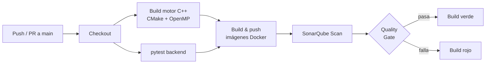

# 06 — CI/CD y Calidad de Código

## Workflows en `.github/workflows/`

| Archivo | Propósito |
|---|---|
| [`ci.yml`](../.github/workflows/ci.yml) | Compila el motor C++, corre `pytest` del backend, construye y publica imágenes Docker, y dispara SonarQube. |

## Pipeline



## Integración con SonarQube

La integración está **declarada en YAML** dentro del workflow, **no instalada como plugin** desde el marketplace de GitHub (requisito explícito de la rúbrica).

Snippet relevante:

```yaml
- name: SonarQube Scan
  uses: sonarsource/sonarqube-scan-action@v2
  env:
    SONAR_TOKEN: ${{ secrets.SONAR_TOKEN }}
    SONAR_HOST_URL: ${{ secrets.SONAR_HOST_URL }}
```

Los secretos `SONAR_TOKEN` y `SONAR_HOST_URL` se configuran como *Repository secrets* en GitHub.

## Evidencia

> **Pendiente**: capturas de:
> - Ejecuciones exitosas del workflow en GitHub Actions.
> - Resultado del Quality Gate de Sonar.
> - Cobertura de pruebas reportada.
