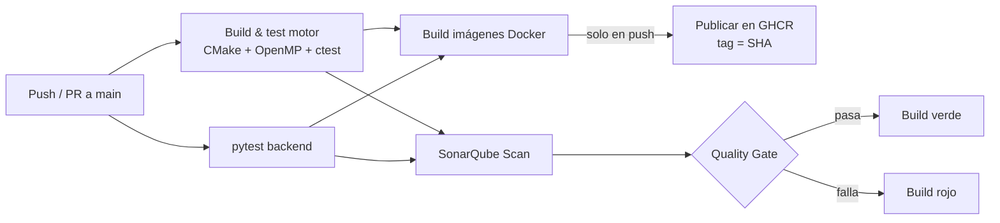
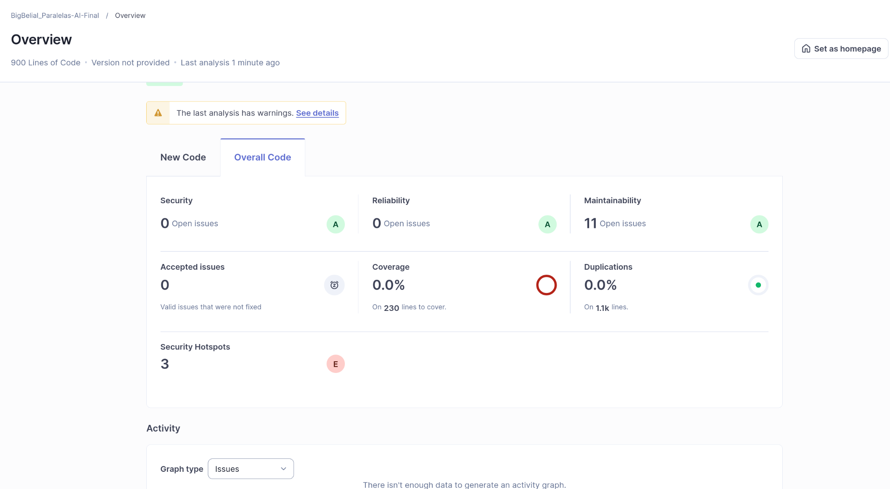
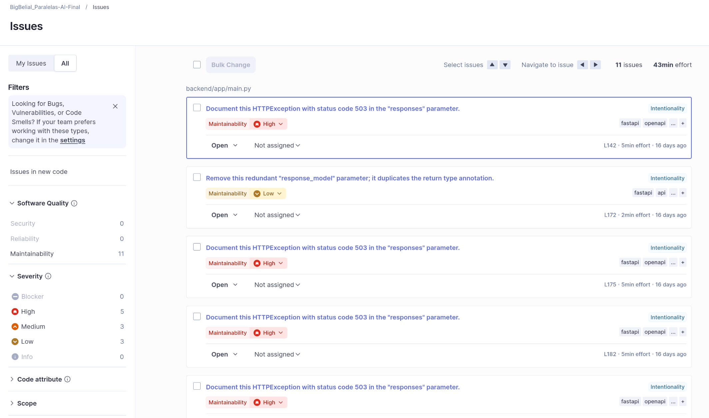

# 06 — CI/CD y Calidad de Código

## Workflow en `.github/workflows/`

Todo el pipeline está descrito en YAML en [`ci.yml`](../.github/workflows/ci.yml),
con cuatro jobs:

| Job | Qué hace |
|---|---|
| `build-and-test-motor` | Compila el motor C++ con CMake + OpenMP, corre los tests unitarios (`ctest`) y un *smoke* del benchmark de Alfa-Beta. |
| `test-backend` | Instala dependencias y corre `pytest` del backend. |
| `docker-images` | Construye las 3 imágenes y, en push a `main`/`master`, las publica en GHCR con tag inmutable. |
| `sonarqube` | Ejecuta el escáner de SonarQube declarado íntegramente en YAML. |

## Pipeline



## Publicación de imágenes

En pull requests solo se **construyen** las imágenes (validación); en push a la
rama principal se **publican** a GHCR. El tag es el SHA del commit
(`ghcr.io/<owner>/<repo>/mancala-<componente>:<sha>`), nunca `latest`, para que el
despliegue sea reproducible. El prefijo del repositorio se pasa a minúsculas
porque GHCR no admite mayúsculas en el nombre.

## Integración con SonarQube

Declarada **íntegramente en YAML** con `sonarsource/sonarqube-scan-action@v2`,
**no** como plugin del marketplace (requisito explícito de la rúbrica). Toda la
configuración del proyecto se pasa como argumentos `-Dsonar.*` al scanner dentro
del propio workflow — no existe `sonar-project.properties`.

> **Decisión técnica: SonarQube self-hosted.** El repositorio es privado, por lo
> que SonarCloud gratuito no es aplicable (requiere repositorio público). Se
> desplegó una instancia de **SonarQube Community Edition** localmente con Docker
> (`sonarqube:community` en el puerto 9090) y el análisis se corrió con el
> `sonar-scanner-cli` nativo en Linux apuntando a esa instancia. La integración
> en YAML usa `SONAR_HOST_URL` configurable por secret, con `http://localhost:9090`
> como valor por defecto para reproducir el análisis localmente.

> **Decisión técnica: motor C++ fuera del análisis Sonar.** SonarQube requiere un
> *build-wrapper* para analizar C/C++. Como orquestarlo queda fuera del alcance
> de esta entrega, el análisis cubre el **backend (Python)** y el **frontend (JS)**,
> y el C/C++ se deshabilita con `-Dsonar.{c,cpp,objc}.file.suffixes=-` y
> excluyendo `motor/**`. La calidad del motor C++ se respalda con sus pruebas
> unitarias en CI (`ctest`).

El job **se salta si no hay `SONAR_TOKEN`** configurado como secret, para que el
CI quede en verde en entornos sin SonarQube:

```yaml
env:
  SONAR_TOKEN: ${{ secrets.SONAR_TOKEN }}
  SONAR_HOST_URL: ${{ secrets.SONAR_HOST_URL || 'http://localhost:9090' }}
steps:
  - uses: actions/checkout@v4
    with:
      fetch-depth: 0
  - name: SonarQube Scan
    if: ${{ env.SONAR_TOKEN != '' }}
    uses: sonarsource/sonarqube-scan-action@v2
    with:
      args: >
        -Dsonar.projectKey=BigBelial_Paralelas-AI-Final
        -Dsonar.projectVersion=0.2.0
        -Dsonar.sources=backend/app,frontend/public
        -Dsonar.tests=backend/tests
        -Dsonar.exclusions=**/build/**,**/node_modules/**,**/__pycache__/**,motor/**
        -Dsonar.c.file.suffixes=-
        -Dsonar.cpp.file.suffixes=-
        -Dsonar.objc.file.suffixes=-
        -Dsonar.sourceEncoding=UTF-8
```

Para reproducir el análisis localmente:

```bash
# 1. Levantar SonarQube
docker run -d --name sonarqube -p 9090:9000 sonarqube:community

# 2. Descargar el scanner
wget https://binaries.sonarsource.com/Distribution/sonar-scanner-cli/sonar-scanner-cli-6.2.1.4610-linux-x64.zip
unzip sonar-scanner-cli-6.2.1.4610-linux-x64.zip

# 3. Correr el análisis (desde la raíz del proyecto)
./sonar-scanner-6.2.1.4610-linux-x64/bin/sonar-scanner \
  -Dsonar.projectKey=BigBelial_Paralelas-AI-Final \
  -Dsonar.sources=backend/app,frontend/public \
  -Dsonar.tests=backend/tests \
  -Dsonar.exclusions=**/build/**,**/__pycache__/**,motor/** \
  -Dsonar.c.file.suffixes=- \
  -Dsonar.cpp.file.suffixes=- \
  -Dsonar.sourceEncoding=UTF-8 \
  -Dsonar.host.url=http://localhost:9090 \
  -Dsonar.token=<SONAR_TOKEN>
```

## Resultados del análisis

El análisis sobre **900 líneas de código** (backend Python + frontend JS) produjo
los siguientes resultados:

| Métrica | Resultado |
|---|---|
| Quality Gate | **Passed** |
| Security | **A** — 0 issues |
| Reliability | **A** — 0 issues |
| Maintainability | **A** — 11 code smells menores |
| Duplicaciones | 0.0% |
| Cobertura | 0.0% (sin reporte de cobertura integrado) |

Los 11 code smells son todos de severidad baja/media en el frontend JS y el
backend Python — ninguno afecta la corrección ni la seguridad del sistema.

## Evidencia

### Dashboard SonarQube — Quality Gate Passed



### Lista de issues detectados



[← 05 Despliegue nube](05-despliegue-nube.md) | [07 Análisis comparativo →](07-analisis-comparativo.md)